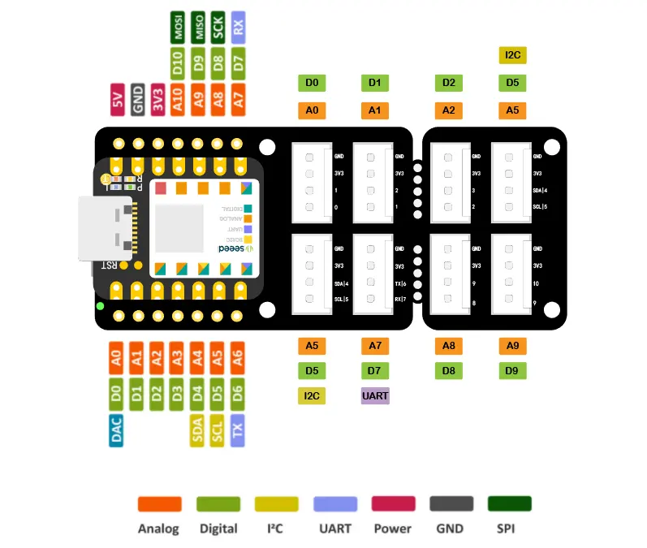

# Setup Guide

## Hardware
- [XIAO ESP32 S3](https://www.seeedstudio.com/Wio-SX1262-with-XIAO-ESP32S3-p-5982.html)
- [Seeed Studio Grove Base for XIAO](https://www.seeedstudio.com/Grove-Shield-for-Seeeduino-XIAO-p-4621.html)
- [SHT 35 Temperature and Humidity Sensor](https://wiki.seeedstudio.com/Grove-I2C_High_Accuracy_Temp%2526Humi_Sensor-SHT35/)
- [Soil Moisture Sensor](https://wiki.seeedstudio.com/Grove-Capacitive_Moisture_Sensor-Corrosion-Resistant/)
- Grove female-female cables


## Arduino IDE
(1) Install Arduino IDE from [here](https://docs.arduino.cc/software/ide-v2/tutorials/getting-started/ide-v2-downloading-and-installing/)

(2) Execute the following code block (Python > 3.12) required
```
sudo usermod -a -G dialout $USER && \
sudo apt-get install git && \
wget https://bootstrap.pypa.io/get-pip.py && \
sudo python3 get-pip.py && \
sudo pip3 install pyserial && \
mkdir -p ~/Arduino/hardware/espressif && \
cd ~/Arduino/hardware/espressif && \
git clone https://github.com/espressif/arduino-esp32.git esp32 && \
cd esp32/tools && \
python3 get.py
```

(3) Restart Arduino IDE

(4) In Arduino, go to: File → Preferences → Additional Board Manager URLs and add `https://raw.githubusercontent.com/espressif/arduino-esp32/gh-pages/package_esp32_index.json`

(5) Go to Tools → Board → Board Manager, and search for esp32 - Install `esp32` by "Espressif Systems" (`Version 3.3.0`)

(6) In Tools → Board → ESP32 Arduino, choose: `XIAO_ESP32S3`

Additional information on the installation process is available [here](https://docs.espressif.com/projects/arduino-esp32/en/latest/installing.html).

## Connecting the XIAO ESP32
Once the Arduino IDE is prepared, connect the Sensor via USB-C - USB cable to your computed. Make sure the cable you use is able to transfer data and not just power only. With the command `lsusb` the Xiao ESP32 should show up. Set baud rate to 115200 in the Serial Monitor.
For testing the connection, use the following script:
```
void setup() {
  Serial.begin(115200);
  Serial.println("ESP32-S3 ready!");
}

void loop() {
  delay(1000);
  Serial.println("Hello from ESP32-S3!");
}
```

Upload it via Arduino IDE. If you run into issues, make sure the permissions are set correctly. Check whether your user has read/write access with `ls -l /dev/ttyACM0` and if not, add it with `sudo usermod -aG dialout $USER`. Reboot afterwards.

If the chip still doesn't connect, you can try the bootloader trick:
	- Hold BOOT button on the XIAO.
	- While holding BOOT, press and release RESET.
	- Release BOOT after ~1 second.
	- In Arduino IDE, click Upload.
You can use two toothpicks to press the buttons.


## Connecting the Sensors
Here is a schematic overview of the base board:


### SHT 35 - (Temperature & Humidity)
Clone the SHT 35 download the SHT 35 library from the [Github repo](https://github.com/Seeed-Studio/Seeed_SHT35) as a **zip file**. Then, in Arduino IDE go to Sketch → Include Library → Add .ZIP Library and add select the downloaded repo. 
Connect the sensor a I2C port of the base board. Try out the following example code:
```
#include "Seeed_SHT35.h"


/*SAMD core*/
#ifdef ARDUINO_SAMD_VARIANT_COMPLIANCE
  #define SDAPIN  20
  #define SCLPIN  21
  #define RSTPIN  7
  #define SERIAL SerialUSB
#else
  #define SDAPIN  A4
  #define SCLPIN  A5
  #define RSTPIN  2
  #define SERIAL Serial
#endif

SHT35 sensor(SCLPIN);


void setup()
{
    SERIAL.begin(115200);
    delay(10);
    SERIAL.println("serial start!!");
    if(sensor.init())
    {
      SERIAL.println("sensor init failed!!!");
    }
    delay(1000);
}


void loop()
{
    u16 value=0;
    u8 data[6]={0};
    float temp,hum;
    if(NO_ERROR!=sensor.read_meas_data_single_shot(HIGH_REP_WITH_STRCH,&temp,&hum))
    {
      SERIAL.println("read temp failed!!");
    }
    else
    {
      SERIAL.println("Sensor readings:");
      SERIAL.print("temperature = ");
      SERIAL.println(temp);
      SERIAL.print("humidity = ");
      SERIAL.println(hum);
    }
    delay(1000);
}
```


### Soil Moisture Sensor
The Soil Moisture Sensor does not require installing an additional library. Connect the sensor a analog port of the base board. The moisture sensor sends analog signals. Try it out by uploading the following script:
```
void setup() {
  Serial.begin(9600);
}

void loop() {
  // read the input on analog pin 0:
  int sensorValue = analogRead(A0);
  Serial.println(sensorValue);
  delay(1000);
}
```

