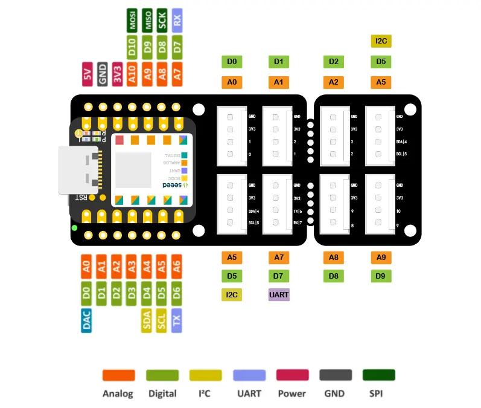

# Croptopus

A LoRa-based environmental sensor network for soil and garden monitoring.
Each station measures temperature, humidity, and soil moisture and beams a
compact binary packet to a self-hosted gateway over private 868 MHz RF — no
internet, no LoRaWAN, no third-party network.



## Architecture

```
  ┌──────────────────┐         ┌──────────────────┐         ┌──────────────────┐
  │ Sensor station N │         │ Sensor station 2 │         │ Sensor station 1 │
  │ XIAO ESP32S3     │         │ XIAO ESP32S3     │         │ XIAO ESP32S3     │
  │ + Wio-SX1262     │         │ + Wio-SX1262     │   ...   │ + Wio-SX1262     │
  │ + SHT35  + soil  │         │ + SHT35  + soil  │         │ + SHT35  + soil  │
  └────────┬─────────┘         └────────┬─────────┘         └────────┬─────────┘
           │                            │                            │
           │   raw LoRa, 868.1 MHz, SF7, BW125, sync word 0x34        │
           └────────────────────────────┼────────────────────────────┘
                                        ▼
                              ┌──────────────────────┐
                              │ Gateway (BeagleBone) │
                              │ Seeed WM1302 (EU868) │
                              │ sx1302_hal           │
                              │ lora_pkt_fwd         │
                              │   → 127.0.0.1:1700   │
                              └──────────┬───────────┘
                                         ▼
                              ┌──────────────────────┐
                              │ Python listener      │
                              │ parses Semtech UDP   │
                              │ decodes 7-byte frame │
                              └──────────────────────┘
```

1. **Sensor stations.** Battery- or USB-powered Seeed XIAO ESP32S3 boards with
   a Wio-SX1262 LoRa carrier, an SHT35 temperature/humidity sensor on I2C, and
   an analog soil-moisture probe on A0. Each station has a 16-bit short ID
   derived from its ESP32-S3 factory MAC (read from eFuse at boot) and
   transmits a 7-byte payload every 60 s.
2. **Gateway.** A Seeed WM1302 (USB version, EU868) on a BeagleBone, running
   `sx1302_hal`'s `lora_pkt_fwd` configured to forward upstream packets to
   `127.0.0.1:1700` — i.e. localhost, *not* The Things Network.
3. **Receiver.** A small Python listener on the same BeagleBone reads the
   Semtech UDP packet-forwarder protocol and decodes the binary payload.

**This repository covers the sensor-station side only** — the gateway
configuration and the Python listener live outside this repo for now and may
be added later.

## Raw LoRa, not LoRaWAN

The stations speak **raw LoRa**, not LoRaWAN. We own both ends of the radio
link, so the LoRaWAN MAC layer (join procedure, frame counters, encryption,
network/application servers) is unnecessary overhead. The tradeoffs are
deliberate:

| Aspect             | This setup                | LoRaWAN equivalent              |
| ------------------ | ------------------------- | ------------------------------- |
| Network            | Private, no internet      | Public/TTN, internet-dependent  |
| Encryption         | None                      | AES-128                         |
| Duty cycle         | Self-policed              | Enforced by MAC                 |
| Downlinks          | Not supported             | Class A/B/C                     |
| Roaming/coverage   | Single gateway only       | Any compatible gateway          |
| Complexity         | Send 7 bytes and done     | Join, ABP/OTAA, server config   |

The one LoRaWAN-flavoured detail we keep: the LoRa **sync word is `0x34`**
("public network"). The WM1302's SX1302 demodulator runs with
`lorawan_public=1` and ignores packets that use RadioLib's default `0x12`
("private"). Setting `0x34` on the sender is what makes the gateway accept the
frames.

## Hardware (per sensor station)

- [Seeed XIAO ESP32S3 + Wio-SX1262 carrier](https://www.seeedstudio.com/Wio-SX1262-with-XIAO-ESP32S3-p-5982.html)
- [Seeed Grove Base for XIAO](https://www.seeedstudio.com/Grove-Shield-for-Seeeduino-XIAO-p-4621.html)
- [Grove SHT35 temperature & humidity sensor](https://wiki.seeedstudio.com/Grove-I2C_High_Accuracy_Temp%2526Humi_Sensor-SHT35/)
- [Grove capacitive soil-moisture sensor](https://wiki.seeedstudio.com/Grove-Capacitive_Moisture_Sensor-Corrosion-Resistant/)
- Grove female–female cables, USB-C data cable

Wire the SHT35 to any I2C Grove port and the soil probe to the A0 Grove port.

## Repo layout

```
croptopus/
├── README.md
├── stations.csv                        # registry of flashed stations (auto-generated)
├── images/
│   └── 3_32.jpeg                       # Grove base pinout
└── xiao-station-flasher/
    ├── setup_arduino_cli.sh            # one-time toolchain setup
    ├── flash_xiao_station.sh           # flash one station; identity is MAC-derived
    └── xiao_lora_sensor/
        └── xiao_lora_sensor.ino        # the sensor sketch
```

## Station identity

Each XIAO ESP32S3 has a **factory MAC address** burned into eFuse — globally
unique across all ESP32-S3 chips ever made. The sketch reads this MAC at boot
and derives a 16-bit **short ID** from it via FNV-1a-16 (FNV-1a folded to 16
bits). The short ID is what goes on the air; the full MAC is reported on the
serial banner and recorded in `stations.csv` when you flash the device.

Why this scheme:

- **No manual ID assignment.** You no longer have to remember which `N` you
  last used or worry about colliding with a station already in the field.
- **Globally unique by construction.** The MAC is unique; collisions on the
  16-bit short ID are vanishingly rare at our scale (a 65536-element space
  hashing ~10s of stations).
- **Still only 2 bytes on air.** Adds 1 byte vs. the old 1-byte STATION_ID.
- **Escape hatch preserved.** Pass `--force-id N` to bake a fixed short ID
  in at compile time — useful for test rigs or pinning a known value.

The repo-root `stations.csv` is the registry. Every `flash_xiao_station.sh`
run appends a row recording the flash timestamp, MAC, short ID, optional
human label, and the USB port — so you can later look up which physical
device a given short ID belongs to.

## Quick start (scripted flashing)

This is the recommended path: install `arduino-cli` once, then flash each
station with a single command. No editing of `.ino` files between stations.

### One-time setup

```bash
cd xiao-station-flasher
./setup_arduino_cli.sh
```

The script will:

- Install `arduino-cli` to `~/bin` (skipped if already present).
- Initialise `~/.arduino15/arduino-cli.yaml` with `~/Arduino` as the
  sketchbook and Espressif's board-manager URL.
- Install the `esp32:esp32` core and verify that the `XIAO_ESP32S3` board
  variant is available.
- Install **RadioLib** (Jan Gromes) and the Seeed SHT35 library
  (`Grove - Integrated Smart Station - SHT35`, with a Git-URL fallback to
  `https://github.com/Seeed-Studio/Seeed_SHT35.git` if the registry name has
  changed).
- Test-compile the sketch with `-DSTATION_ID_OVERRIDE=99` to confirm the
  toolchain works. (The runtime sketch defaults to MAC-derived identity;
  this flag is only used by the test compile and by `--force-id`.)

If `~/bin` isn't already on your `PATH`, add this to your shell rc file:

```bash
export PATH="$HOME/bin:$PATH"
```

You only need to run `setup_arduino_cli.sh` once per workstation.

### Flashing a station

Plug a single XIAO into USB-C (use a data cable, not a power-only one), then:

```bash
./flash_xiao_station.sh [station_label]
```

`station_label` is an optional free-form human label (`greenhouse`, `back
garden`, etc.) stored in `stations.csv`. Quote it if it contains spaces:

```bash
./flash_xiao_station.sh                    # no label
./flash_xiao_station.sh greenhouse         # labelled
./flash_xiao_station.sh "back garden"
./flash_xiao_station.sh test-rig --force-id 42   # pin short ID, bypass MAC
```

The script:

1. Detects connected XIAOs by USB VID (`0x303A` for the ESP32-S3 native
   USB/JTAG interface, plus the legacy Seeed `0x2886`).
2. **Aborts if more than one XIAO is connected** — prevents accidentally
   re-flashing an existing station.
3. Compiles the sketch. By default, identity is read from the chip's factory
   MAC at boot. With `--force-id N`, compiles with
   `-DSTATION_ID_OVERRIDE=N` so the short ID is pinned to `N`.
4. Uploads to the detected port via `arduino-cli upload`.
5. Briefly opens the serial port (12 s) to capture the boot banner and
   extract the device's `STATION MAC` and `STATION SHORT_ID`.
6. Appends a row to `stations.csv` at the repo root with timestamp, MAC,
   short ID, label, and port. The file is created with a header if missing.

Repeat: unplug the flashed station, plug the next one in, run
`./flash_xiao_station.sh [label]` again.

Watch a freshly flashed station boot at any time:

```bash
arduino-cli monitor -p /dev/ttyACM0 --config baudrate=115200
```

## Arduino IDE (legacy path)

If you prefer Arduino IDE — or want to tweak the sketch interactively —
follow the steps below. The IDE path runs the sketch unmodified: identity
is derived from the chip's factory MAC at boot, so you don't have to edit
anything per device. To pin a specific short ID for testing instead, open
**Sketch → Show Sketch Folder**, add a `build.opt` (or use *Custom build
options*) with `-DSTATION_ID_OVERRIDE=N`, or just use `flash_xiao_station.sh
--force-id N` from the command line.

To learn a freshly flashed board's MAC and short ID, open the Serial Monitor
at 115200 baud and watch the boot banner:

```
=== XIAO sensor station ===
STATION MAC: 8C:BF:EA:8E:E1:88
STATION SHORT_ID: 0x4F2A
```

### Installing the IDE and ESP32 core

(1) Install Arduino IDE from [here](https://docs.arduino.cc/software/ide-v2/tutorials/getting-started/ide-v2-downloading-and-installing/).

(2) Execute the following code block (Python > 3.12 required):

```bash
sudo usermod -a -G dialout $USER && \
sudo apt-get install git && \
wget https://bootstrap.pypa.io/get-pip.py && \
sudo python3 get-pip.py && \
sudo pip install pyserial && \
mkdir -p ~/Arduino/hardware/espressif && \
cd ~/Arduino/hardware/espressif && \
git clone https://github.com/espressif/arduino-esp32.git esp32 && \
cd esp32/tools && \
python get.py
```

(3) Restart Arduino IDE.

(4) In Arduino, go to: **File → Preferences → Additional Board Manager URLs**
and add `https://raw.githubusercontent.com/espressif/arduino-esp32/gh-pages/package_esp32_index.json`.

(5) Go to **Tools → Board → Board Manager**, search for `esp32`, and install
`esp32` by Espressif Systems (Version 3.3.0).

(6) In **Tools → Board → ESP32 Arduino**, choose: `XIAO_ESP32S3`.

Additional info on the install process: [Espressif Arduino docs](https://docs.espressif.com/projects/arduino-esp32/en/latest/installing.html).

### Connecting the XIAO ESP32

Once the IDE is prepared, connect the sensor via a USB-C data cable. With
`lsusb` the XIAO should show up. Set the baud rate to 115200 in the Serial
Monitor. For a quick smoke test:

```cpp
void setup() {
  Serial.begin(115200);
  Serial.println("ESP32-S3 ready!");
}

void loop() {
  delay(1000);
  Serial.println("Hello from ESP32-S3!");
}
```

Upload via Arduino IDE. If you hit permission errors, check with
`ls -l /dev/ttyACM0`; if your user isn't in `dialout`, add it with
`sudo usermod -aG dialout $USER` and reboot.

If the chip still doesn't connect, force the bootloader:

- Hold **BOOT** on the XIAO.
- While holding BOOT, press and release **RESET**.
- Release BOOT after ~1 second.
- In Arduino IDE, click Upload.

Two toothpicks help.

### Connecting the sensors

The Grove base board pinout is shown at the top of this README.

#### SHT35 (temperature & humidity)

Download the SHT35 library from the [Seeed_SHT35 repo](https://github.com/Seeed-Studio/Seeed_SHT35)
as a **zip**. In Arduino IDE: **Sketch → Include Library → Add .ZIP Library**
and select the downloaded zip. Connect the sensor to an I2C Grove port. Test
with:

```cpp
#include "Seeed_SHT35.h"

#ifdef ARDUINO_SAMD_VARIANT_COMPLIANCE
  #define SDAPIN  20
  #define SCLPIN  21
  #define RSTPIN  7
  #define SERIAL SerialUSB
#else
  #define SDAPIN  A4
  #define SCLPIN  A5
  #define RSTPIN  2
  #define SERIAL Serial
#endif

SHT35 sensor(SCLPIN);

void setup() {
    SERIAL.begin(115200);
    delay(10);
    SERIAL.println("serial start!!");
    if (sensor.init()) {
      SERIAL.println("sensor init failed!!!");
    }
    delay(1000);
}

void loop() {
    float temp, hum;
    if (NO_ERROR != sensor.read_meas_data_single_shot(HIGH_REP_WITH_STRCH, &temp, &hum)) {
      SERIAL.println("read temp failed!!");
    } else {
      SERIAL.println("Sensor readings:");
      SERIAL.print("temperature = "); SERIAL.println(temp);
      SERIAL.print("humidity = ");    SERIAL.println(hum);
    }
    delay(1000);
}
```

#### Soil moisture sensor

No library required. Connect to an analog Grove port. Smoke test:

```cpp
void setup() {
  Serial.begin(9600);
}

void loop() {
  int sensorValue = analogRead(A0);
  Serial.println(sensorValue);
  delay(1000);
}
```

### Installing RadioLib (for the LoRa sketch)

In **Sketch → Include Library → Manage Libraries**, search for **RadioLib**
by Jan Gromes (version 6.0.0 or newer) and install. Then open
`xiao-station-flasher/xiao_lora_sensor/xiao_lora_sensor.ino` and upload.
The default sketch builds with MAC-derived identity — no per-device edits
needed.

## Payload format

Each uplink is exactly 7 bytes, big-endian:

| Offset | Type    | Field            | Notes                                            |
| -----: | ------- | ---------------- | ------------------------------------------------ |
|    0–1 | uint16  | short station ID | FNV-1a-16 of the 6-byte factory MAC              |
|    2–3 | int16   | temperature ×100 | °C × 100; `0x8000` = SHT35 read failed           |
|    4–5 | uint16  | humidity ×100    | %RH × 100; `0xFFFF` = SHT35 read failed          |
|      6 | uint8   | soil moisture %  | 0..100, clamped                                  |

### Worked example

```
4F 2A 09 09 16 E5 0D
└─┬─┘ └─┬─┘ └─┬─┘ │
  │     │     │   └─ 0x0D       = 13   →  soil moisture 13 %
  │     │     └───── 0x16E5     = 5861 →  humidity      58.61 %RH
  │     └─────────── 0x0909     = 2313 →  temperature   23.13 °C
  └───────────────── 0x4F2A            →  short ID 0x4F2A
                                          (look up MAC in stations.csv)
```

## Multiple stations

Identity is MAC-derived, so there is no manual `STATION_ID` to assign.
Practical workflow for rolling out N stations:

```bash
./flash_xiao_station.sh greenhouse     # plug station, flash, unplug
./flash_xiao_station.sh "back garden"  # next one
./flash_xiao_station.sh                # next one, no label
```

Each run appends a row to `stations.csv` at the repo root:

```
timestamp,mac,short_id,station_label,port
2026-05-28T14:21:09Z,8C:BF:EA:8E:E1:88,0x4F2A,"greenhouse",/dev/ttyACM0
2026-05-28T14:23:47Z,8C:BF:EA:9C:02:14,0xA7E1,"back garden",/dev/ttyACM0
```

That's how you later map a short ID seen on the gateway back to a physical
station. Label the device housing with its short ID before deploying — the
chips are visually identical.

## Downstream change required: BBB listener decoder

The Python listener on the BeagleBone (the `decode_sensor_payload` function
in `lora_listener.py`, which lives outside this repo) currently expects the
old **6-byte** layout with a **1-byte** station ID. After flashing any
station with the new firmware, that decoder **must** be updated to:

- Expect **7-byte** payloads.
- Read offsets `[0..1]` as a **uint16 big-endian short ID** instead of a
  uint8 at offset `0`.
- Shift the other field offsets by +1 (temperature now at `[2..3]`,
  humidity at `[4..5]`, soil at `[6]`).
- Demultiplex on the 16-bit short ID rather than the 1-byte station ID.

Any historical data already stored with the old 6-byte / 1-byte ID format
will also need a migration plan (rename per-station series, or carry the
old ID alongside the new short ID). This repo doesn't touch that —
flagged here so it isn't forgotten.

## Troubleshooting

**`arduino-cli: command not found` after running setup.**
`~/bin` isn't on your `PATH` for the current shell. Run
`export PATH="$HOME/bin:$PATH"` and add the same line to `~/.bashrc` (or
`~/.zshrc`).

**`No XIAO ESP32S3 detected`.**
The board's small LED should be lit when powered. Verify with
`arduino-cli board list`. The detection script matches USB VID `0x303A`
(ESP32-S3 native USB) or `0x2886` (Seeed), plus any board `arduino-cli`
explicitly tags as `XIAO_ESP32S3`. A power-only USB cable will not be
detected — use a data cable.

**`ERROR: N XIAOs detected`.**
Intentional safety check: with more than one XIAO on USB, the script
refuses to guess which one to flash. Unplug all but the target and retry.

**`Could not connect to chip` during upload.**
Force the bootloader manually:

1. Hold **BOOT** on the XIAO.
2. Press and release **RESET** while holding BOOT.
3. Release BOOT.
4. Re-run `./flash_xiao_station.sh <id>`.

**`SHT35 init FAILED` in the serial monitor.**
The sensor isn't responding on I2C. Check the Grove cable orientation and
that the sensor is plugged into an I2C port (not analog or UART). The
sketch continues running — sensor reads return the `0x8000` / `0xFFFF`
sentinels in the payload until the sensor responds.

**`Radio init FAILED, code <n>`.**
The Wio-SX1262 carrier didn't initialise. Confirm the XIAO is actually
seated on the SX1262 carrier board (not just the Grove base). Sensor reads
will continue, but no RF will be transmitted.

**Seeed SHT35 library not found in registry.**
The setup script falls back to installing directly from the GitHub repo via
`arduino-cli lib install --git-url https://github.com/Seeed-Studio/Seeed_SHT35.git`.
This works because the setup also sets
`library.enable_unsafe_install=true`.

**ESP32 core too old (`XIAO_ESP32S3 not in installed esp32 core`).**
Upgrade with `arduino-cli core upgrade esp32:esp32`.
